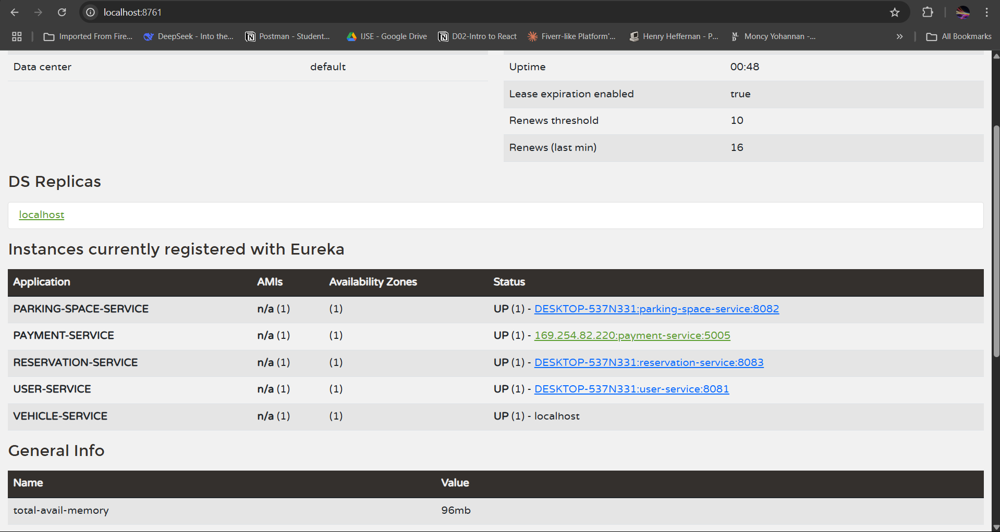

# 🚗 Smart Parking Management System

The **Smart Parking Management System** is a microservices-based solution designed to automate parking operations, including space reservation, vehicle tracking, user management, and payment processing.

---

## 📦 Microservices Architecture

This project is built using Spring Boot, Node.js, and Python, with services communicating through REST APIs and registered under Eureka Service Discovery.

| Service Name           | Technology | Description                         |
|------------------------|------------|-------------------------------------|
| `user-service`         | Spring Boot (Java) | Handles user registration and authentication |
| `vehicle-service`      | Node.js + MongoDB   | Manages vehicles linked to users        |
| `parking-space-service`| Spring Boot (Java) | Manages available parking slots         |
| `reservation-service`  | Spring Boot (Java) | Books parking slots for users          |
| `payment-service`      | Python + Flask     | Handles payment transactions            |
| `eureka-server`        | Spring Boot        | Service discovery for all services      |
| `api-gateway`          | Spring Cloud Gateway | Central gateway for routing API calls  |

---

## 🚀 Technologies Used

- **Spring Boot** (Java)
- **Node.js** (Express, Mongoose)
- **Python Flask**
- **MongoDB (Atlas)**
- **MySQL**
- **JWT Authentication**
- **Eureka Server**
- **Postman for API Testing**

---

## 📮 API Collections

All API endpoints for each microservice have been documented and tested using Postman. You can find the exported collection files below:

- [User Service Collection](./postmanCollection/User.postman_collection.json)
- [Vehicle Service Collection](./postmanCollection/Vehicle.postman_collection.json)
- [Parking Space Service Collection](./postmanCollection/ParkingSpace.postman_collection.json)
- [Reservation Service Collection](./postmanCollection/Reservations.postman_collection.json)
- [Payment Service Collection](./postmanCollection/Payment.postman_collection.json)

> 💡 These collections can be imported into Postman directly to test individual service endpoints.

---

## 🛰️ Eureka Service Registry

The following screenshot displays the Eureka Dashboard with all microservices successfully registered and discoverable:

## 🛠️ Running the Project

### Prerequisites
- JDK 17+
- Node.js 18+
- Python 3.10+
- MongoDB Atlas account
- MySQL Server
- Postman

### Step-by-Step
1. **Start Eureka Server** (`localhost:8761`)
2. **Start API Gateway**
3. **Start all other microservices**
4. **Access endpoints via Gateway**

---

## 🔐 Authentication

- JWT-based authentication is implemented.

---

## 📃 Author

Shewmi Peiris  
📧 shewmipeiris123@gmail.com  

---

## 📄 License

This project is for academic purposes and not for commercial use.

